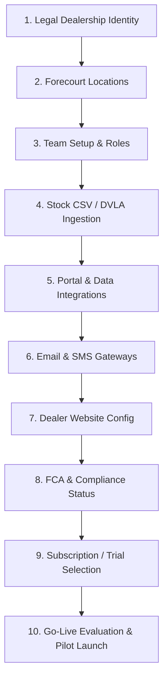

# ForecourIQ DMS — Dealer Onboarding Guide

> **Audience**: Dealer Principals, ForecourIQ Customer Success  
> **Version**: Phase 9  
> **Classification**: Operational Runbook

---

## 1. Overview & Go-Live Philosophy

ForecourIQ DMS employs a **deterministic Go-Live gate evaluation model**. A dealership cannot be activated for live operations until all core operational and legal prerequisites are satisfied:

$$\text{Go-Live Score} = \frac{\text{Passed Checks}}{\text{Total Checks}} \times 100$$

Where **Blockers** (P0 requirements) prevent activation regardless of overall score.

---

## 2. Onboarding Workflow (10 Steps)

### Step Breakdown

| Step | Scope | Blocker Threshold |
|---|---|---|
| **1. Dealership Details** | Company legal name, registered address, postcode, contact phone. | **Hard Blocker** |
| **2. Locations** | Primary operating site & showroom details. | **Hard Blocker** |
| **3. Team Setup** | At least one active Dealer Principal or Administrator profile. | **Hard Blocker** |
| **4. Stock Import** | Vehicle inventory via CSV or direct entry. | Advisory Warning |
| **5. Integrations** | AutoTrader Connect, DVLA VES, CAP HPI credentials. | Advisory Warning |
| **6. Communications** | SendGrid / Resend / Twilio API configuration. | Advisory Warning |
| **7. Dealer Website** | Domain setup, branding, and opening hours. | Advisory Warning |
| **8. Compliance** | FCA status, ICO data protection registration number. | Advisory Warning |
| **9. Billing** | Active Stripe subscription or approved Pilot trial. | **Hard Blocker** |
| **10. Review** | Deterministic readiness check (`/api/onboarding/go-live`). | Score ≥ 70% & 0 Blockers |

---

## 3. Data Import Protocols

### Stock CSV Import (`/stock/import`)
- Minimum required fields: `registration`, `make`, `model`.
- Registration numbers are automatically stripped of spaces and converted to uppercase.
- Idempotent: duplicates within the same batch are rejected with row-level error reporting.

### Customer CSV Import (`/customers/import`)
- Minimum required fields: `first_name` or `last_name`.
- **GDPR Consent Safety Rule**: Marketing consent is strictly set to `false` unless the CSV row includes explicit affirmative consent text AND a valid consent timestamp.
