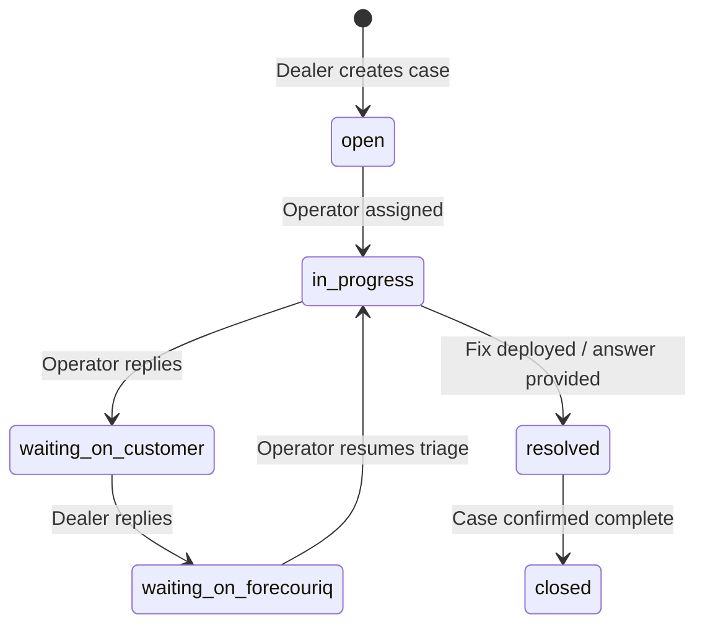

# ForecourIQ DMS — Support Operations & Triage Manual

> **Audience**: Platform Operators, Customer Support  
> **Version**: Phase 9  
> **Classification**: Operational Manual

---

## 1. Support Case Lifecycle

ForecourIQ DMS includes an integrated multi-tenant support case system accessible to dealers at `/support` and operators at `/platform`.

---

## 2. Priority Definitions & SLAs

| Priority | Target First Response | Description |
|---|---|---|
| **Critical** | < 2 Hours | Complete system outage, data loss risk, or stock publishing failure affecting active sales. |
| **High** | < 8 Hours | Core workflow degraded (e.g. leads not routing, valuation lookups failing). |
| **Normal** | < 24 Hours | How-to enquiries, UI adjustments, general feedback, export requests. |

---

## 3. Internal Support Notes

Operators can flag messages with `is_internal_note = true`. These messages:
- Are only visible to authenticated Platform Operators (`platform_operators` table).
- Are strictly filtered out of dealer-facing API queries (`is_internal_note = false`).
